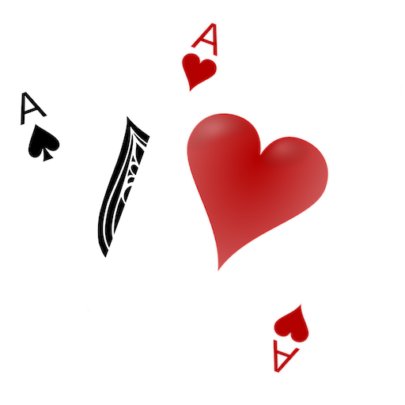

<h1 align="center">
  
   
  Texas Hold'em Opening Range Assistant
   
</h1>

Hold'em Poker Tools Range Assistant is free, open source software for creating and viewing
pre-flop opening ranges for any scenario. You can create complex, balanced ranges for every
card combo in any pre-flop scenario using the free [web app](https://rangeassistant.holdempoker.tools),
then export the range to use with the desktop app whilst you are playing on online poker rooms.

The desktop app is currently available for OS X and Windows (beta)!

  <a href="#download">Download</a> •
  <a href="#key-features">Key Features</a> •
  <a href="#credits">Credits</a> •
  <a href="#support">Support</a> •
  <a href="#license">License</a>

## Download

See the [Releases page](https://github.com/HoldemPokerTools/RangeAssistant/releases) to download
the desktop app.

## Key Features

- Create complex, balanced preflop ranges with up to 12
  customisable actions
- Simple interface with drag-to-copy support
- RNG based action selection for a given combo
- Store virtually unlimited ranges for any preflop situation
  or opponent type
- Save and export ranges to share with the poker community
- 150+ free example charts for tournament players
- Available on OS X and Windows

## Credits

This tool is made possible thanks to the following open
source projects:

- [Electron](https://www.electronjs.org/)
- [Node.js](https://nodejs.org/)
- [React](https://reactjs.org/)
- [Ant Design](https://ant.design/)
- [PouchDB](https://pouchdb.com/)

## Support

All Hold'em Poker Tools projects are open source and free to use or
extend to your heart's extent. If you'd like to say thanks,
feel free to show your support on Buy Me a Coffee:

## License

MIT
